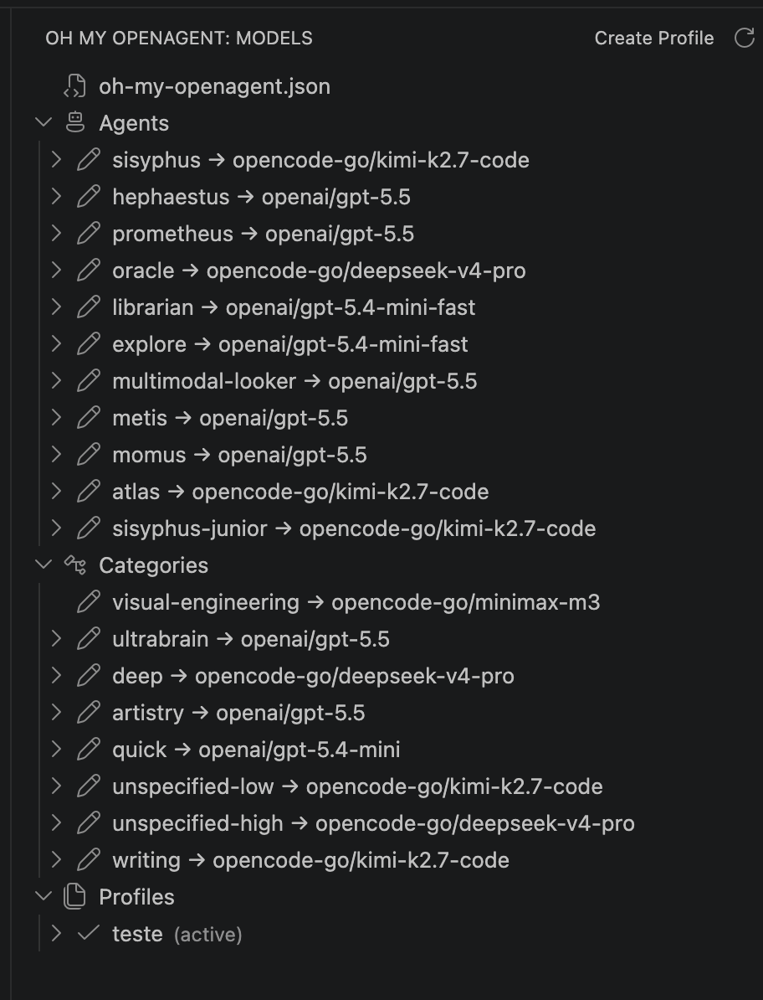

# Oh My OpenAgent for VS Code

A VS Code companion extension for [Oh My OpenAgent](https://omo.dev) — a community-driven enhancement layer for OpenAI Codex CLI. It gives you a visual tree of agents, categories, and profiles, and a form-based editor for model overrides without hand-editing JSONC files.

- **GitHub**: [github.com/oh-my-openagent/oh-my-openagent](https://github.com/oh-my-openagent/oh-my-openagent) — main project repository
- **Site**: [omo.dev](https://omo.dev) — official documentation and downloads

## Screenshots

The sidebar view shows your active config, all built-in agents and categories with their assigned models, and saved profiles. The editor panel opens on demand for any agent or category — it supports model selection, sampling parameters, thinking budgets, and fallback models.

| Sidebar overview | Agent editor in action |
|:---:|:---:|
|  |  |

## Features

- **Agent and category model overrides** — see all 11 built-in agents and 8 built-in categories in a hierarchical tree. Add empty override slots with one click, then edit them in the webview form. The tree renders labels like `sisyphus → opencode-go/kimi-k2.7-code` so you always know which model is assigned.
- **Lazy model picker** — the Model field is populated asynchronously from the local `opencode models --verbose` CLI, with a free-form fallback when the CLI is unavailable. The discovered model IDs appear as autocomplete suggestions alongside each model's capabilities and variants. A reload button lets you re-run discovery at any time.
- **JSONC preservation** — all writes go through `jsonc-parser` via a per-path diff engine. The `ConfigStore` compares the original and modified config recursively, then calls `modify()` on each changed JSON path individually. Comments, trailing commas, and formatting on untouched keys survive every edit.
- **Profiles** — snapshot the current `agents` and `categories` sections into named profiles stored in a sidecar file (`oh-my-openagent.profiles.json`). Switch between them instantly with full JSONC preservation. Each profile can carry an optional description. Active profile is marked with a check icon and `(active)` label.
- **Sidebar integration** — the `Oh My OpenAgent` activity bar view puts everything one click away. Three collapsible groups (Agents, Categories, Profiles) with inline edit buttons, context menu actions, and tooltips that show configured parameters on hover.
- **Command palette support** — all 12 extension commands are available from the Command Palette, including override management and profile CRUD.

## Requirements

- VS Code 1.85 or newer
- An existing Oh My OpenAgent configuration, or a first-run scenario where the extension will create one for you

The extension discovers the active config in this order:

1. `~/.config/opencode/oh-my-openagent.json` (Unix) or `%APPDATA%\opencode\oh-my-openagent.json` (Windows)
2. `~/.config/opencode/oh-my-openagent.jsonc` (Unix) or `%APPDATA%\opencode\oh-my-openagent.jsonc` (Windows)
3. Legacy `oh-my-opencode.json` / `oh-my-opencode.jsonc` in the same directory

Profiles live next to the active config in `oh-my-openagent.profiles.json`.

## Installation

### From a .vsix file

1. Download `oh-my-openagent-vscode-X.Y.Z.vsix` from the release page.
2. Open VS Code and run `Extensions: Install from VSIX...` from the Command Palette.
3. Select the downloaded file.

### Development build

1. Clone the repository:

   ```bash
   git clone https://github.com/oh-my-openagent/oh-my-openagent-vscode.git
   cd oh-my-openagent-vscode
   ```

2. Install dependencies:

   ```bash
   npm install
   ```

3. Compile:

   ```bash
   npm run compile
   ```

4. Press `F5` to open the Extension Development Host with the extension loaded.

## Usage

### Opening the view

- Click the `Oh My OpenAgent` activity bar icon (robot symbol).
- Or run the command `Oh My OpenAgent: Open Agent Manager` from the Command Palette.

The sidebar shows the active config file first, followed by three collapsible groups:

- **Active config file** — the name of the file currently in use (e.g. `oh-my-openagent.json`). Hover to see the full resolved path. This helps when you have fallback configs across multiple files.
- **Agents** — built-in agents; overridden agents are shown as override items.
- **Categories** — built-in categories; overridden categories are shown as override items.
- **Profiles** — saved snapshots of your agents and categories.

Agents, categories, and profiles are expandable when they contain configured values:

- An expanded agent or category shows its configured parameters (`variant`, `reasoning`, `temperature`, `top_p`, `maxTokens`, `thinking`, `verbosity`, `disabled`) and a `fallbacks (N)` group with each fallback model.
- An expanded profile shows nested **Agents** and **Categories** subgroups with the same `name → model` leaves you see in the main tree, so you can inspect what the profile captured before activating it.

The **Profiles** group always shows the active state: when no profile is active, a `No active profile` indicator appears at the top of the group. The active profile is marked with a check icon and an `(active)` description.

### Editing an agent or category

1. Hover over the agent or category and click the pencil inline action, or right-click and choose `Edit Agent` / `Edit Category`. Both built-in items, existing override items, and profile-contained items can be edited.
2. The webview editor opens with sections for Model, Sampling, Thinking, and Fallback models.
3. The Model field is a free-form text input with a lazy datalist. While the editor loads, the extension runs `opencode models --verbose` locally and offers the returned model IDs as autocomplete suggestions, together with each model's capabilities and variants. Any existing model value is preserved, even if it is not in the discovered list.
4. Hover over the reload button next to the Model field to re-run discovery and refresh the model list at any time.
5. Change values and click **Save**. The active config is updated with JSONC preservation, and the sidebar refreshes from the saved config/profile state after the write completes. Fields that exist in the config but are not exposed in the form (such as `permission`, `tools`, `prompt`, `providerOptions`, and rich `fallback_models`) are preserved rather than overwritten.
6. Hover over any agent or category leaf in the sidebar to see a tooltip with the configured parameters (temperature, top-p, max tokens, reasoning effort, thinking budget, variant, and fallback models).

### Context menu actions

Right-click items in the Models view for more options:

- On a built-in agent: `Add Agent Override` creates an empty override entry, and `Edit Agent` opens the editor.
- On a built-in category: `Add Category Override` creates an empty override entry, and `Edit Category` opens the editor.
- On an override item: `Edit Agent` / `Edit Category` opens the editor, and `Remove Override` deletes that override from the active config.
- On a profile: `Activate`, `Rename`, `Duplicate`, or `Delete`.
- Profile-contained agent/category leaves reuse the same `Edit Agent` / `Edit Category` commands as the main tree.

The view title also provides `Refresh` and `Create Profile` buttons.

## Commands

All 12 extension commands are prefixed with **Oh My OpenAgent** in the Command Palette:

| Command | What it does |
| --- | --- |
| `Open Agent Manager` | Focuses the `Oh My OpenAgent` sidebar view. |
| `Edit Agent` | Opens the editor for the selected agent. |
| `Edit Category` | Opens the editor for the selected category. |
| `Refresh` | Refreshes the Models tree from disk. |
| `Add Agent Override` | Adds an empty override for the selected agent. |
| `Add Category Override` | Adds an empty override for the selected category. |
| `Remove Override` | Removes the override for the selected agent or category. |
| `Create Profile` | Creates a new profile from the current config. |
| `Activate Profile` | Applies the selected profile to the active config. |
| `Rename Profile` | Renames the selected profile. |
| `Duplicate Profile` | Creates a copy of the selected profile. |
| `Delete Profile` | Deletes the selected profile after confirmation. |

## Profiles

Profiles are named snapshots of the `agents` and `categories` sections of your active config. They are stored in `oh-my-openagent.profiles.json`, next to your active config file.

### Create a profile

1. Click the `Create Profile` icon in the Models view title, or run `Oh My OpenAgent: Create Profile`.
2. Enter a unique profile name.
3. Optionally enter a description.

The new profile captures the current agents and categories exactly as they are on disk.

### Activate a profile

1. Right-click the profile in the sidebar and choose `Activate`.
2. The active config's `agents` and `categories` sections are replaced with the profile's values.

Activation preserves comments and trailing commas in the active config because it reuses the same JSONC-preserving write path as the editor.

### Rename, duplicate, or delete a profile

- **Rename** updates the profile name. If it was the active profile, `lastActiveProfile` is updated automatically.
- **Duplicate** creates a deep copy under a new name; the original is unchanged.
- **Delete** asks for confirmation and removes the profile. If it was the active profile, the active marker is cleared.

## Architecture

The extension follows a clean layered architecture with strict separation of concerns:

```
extension.ts  (activation orchestrator)
     |
     ├── commands.ts  (12 command handlers)
     |
     ├── ui/
     │   ├── agentModelTreeProvider.ts  (sidebar TreeDataProvider)
     │   └── agentEditorPanel.ts  (webview panel singleton)
     │
     └── config/
         ├── schema.ts  (TypeScript types for OmO config)
         ├── configStore.ts  (JSONC read/write, file watching)
         └── profileStore.ts  (profile CRUD, activation)
```

### Key design decisions

- **ConfigStore is pure Node.js** — zero VS Code dependency, making it testable in isolation with vitest. File watching uses `fs.watch` with 150 ms debounce and a `suppressWatch` flag to ignore self-triggered events during atomic writes.
- **Atomic writes everywhere** — both `ConfigStore` and `ProfileStore` write via temp-file + `fs.renameSync`, guaranteeing no partial content even on crash.
- **Per-path JSONC diffing** — `updateConfig()` deep-clones the parsed config, runs the updater callback, then `diffConfigs()` recursively compares original and draft. Each changed JSON path gets its own `jsonc-parser` `modify()` call, so comments and formatting on untouched keys are never disturbed.
- **Webview security** — strict CSP with `default-src 'none'`, per-render nonces via `crypto.randomBytes(16)`, local resource roots restricted to `out/` only, and all DOM text insertion uses `.textContent` (never `innerHTML`).
- **Singleton editor panel** — `AgentEditorPanel` uses a static `currentPanel` reference to prevent multiple webview instances. Panel state survives tab switches via `retainContextWhenHidden: true`.
- **Sidecar profiles** — profiles are stored in a separate plain JSON file (`oh-my-openagent.profiles.json`) so the main OmO config stays schema-clean. Profile activation writes into the main config through the JSONC-preserving `ConfigStore.updateConfig()` path.

### Built-in inventory

| Domain | Items |
|--------|-------|
| Agents | `sisyphus`, `hephaestus`, `prometheus`, `oracle`, `librarian`, `explore`, `multimodal-looker`, `metis`, `momus`, `atlas`, `sisyphus-junior` (11 total) |
| Categories | `visual-engineering`, `ultrabrain`, `deep`, `artistry`, `quick`, `unspecified-low`, `unspecified-high`, `writing` (8 total) |

## Development

This extension is built with TypeScript and esbuild.

```bash
# Install dependencies
npm install

# One-shot compile
npm run compile

# Watch mode
npm run watch

# Run tests
npm test

# Package for release
vsce package
# or
npm run package
```

To run the extension locally, press `F5` in VS Code. This opens the Extension Development Host with the compiled extension loaded.

### Tests

Tests are written with Vitest and currently run **152 tests across 8 test files**:

| Suite | Tests | What it covers |
|-------|-------|----------------|
| `modelDiscovery.test.ts` | 31 | `opencode models` parsing, fallback handling, metadata normalization, cache behavior |
| `agentModelTreeProvider.test.ts` | 24 | Tree group structure, context-value mapping, override detection, active profile indicator, refresh, dispose |
| `agentEditorPanel.test.ts` | 32 | Webview panel lifecycle, message handling, save writes, profile creation, model discovery reloads |
| `profileStore.test.ts` | 34 | Profile CRUD, rename, duplicate, deep-clone isolation, activation with JSONC preservation, change events |
| `smoke.test.ts` | 1 | End-to-end editor save flow across stores, panel, tree, and JSONC writes |
| `packageMenus.test.ts` | 2 | Package contribution menu wiring for view item actions |
| `configStore.test.ts` | 13 | Config discovery, JSONC parsing, formatting-preserving updates, key removal, file watching |
| `webview.test.ts` | 15 | Webview model picker behavior, save payloads, fallback editing, persisted state |

The JSONC preservation tests verify that comments, trailing commas, and formatting survive round-trips through `updateConfig()` and profile activation — confirmed against real config fixtures with inline comments and trailing commas.

```bash
npm test
```

## Release / packaging

1. Update the version in `package.json`.
2. Run the packaging command:

   ```bash
   vsce package
   ```

3. The resulting `.vsix` file can be uploaded to a release page or installed directly.

The packaging rules in `.vscodeignore` make sure `out/extension.js`, `out/webview.js`, `src/ui/webview/webview.html`, and `src/ui/webview/webview.css` are included, while source maps, tests, and `node_modules` are excluded.

## License

MIT License
