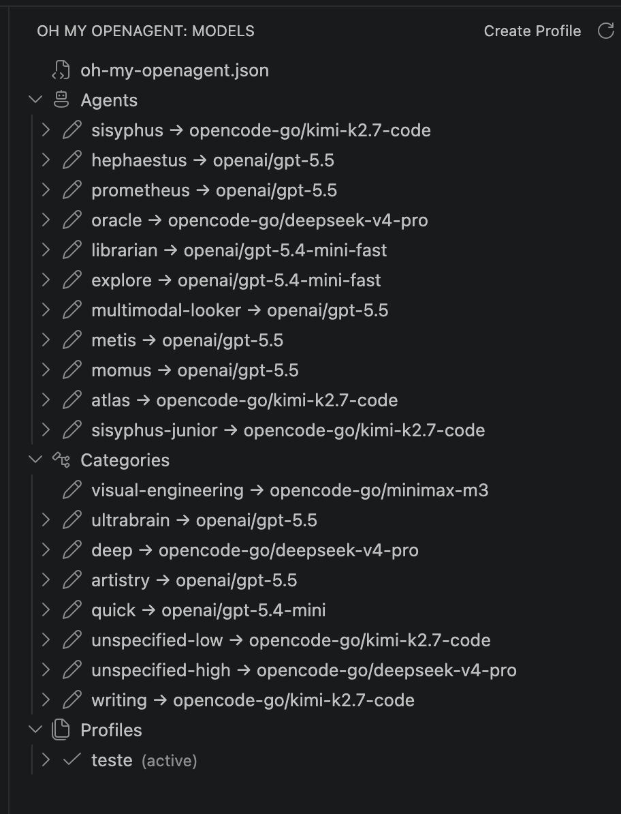

# Oh My OpenAgent for VS Code

A VS Code companion extension for [Oh My OpenAgent](https://omo.dev) — a community-driven enhancement layer for OpenAI Codex CLI. It gives you a visual tree of agents, categories, and profiles, and a form-based editor for model overrides without hand-editing JSONC files.

- **GitHub**: [github.com/oh-my-openagent/oh-my-openagent](https://github.com/oh-my-openagent/oh-my-openagent) — main project repository
- **Site**: [omo.dev](https://omo.dev) — official documentation and downloads

## Screenshots

The sidebar view shows your active config, all built-in agents and categories with their assigned models, and saved profiles. The editor panel opens on demand for any agent or category — it supports model selection, sampling parameters, thinking budgets, and fallback models.

| Sidebar overview | Agent editor in action |
|:---:|:---:|
|  |  |

## Features

- **Agent and category model overrides**: see all 11 built-in agents and 8 built-in categories in a hierarchical tree. Edit any item in the webview form. Saving an edit to a built-in item creates its override. The tree renders labels like `sisyphus → opencode-go/kimi-k2.7-code` so you always know which model is assigned.
- **Ordered model cards**: position 1 is **Main** and every later card is a fallback. Drag any fallback into position 1 to replace Main. The `Drag` handle explains this on hover and supports keyboard reordering: press Space or Enter to pick up, use Arrow Up or Arrow Down to move, press Space or Enter to drop, or Escape to cancel. Main settings are shared defaults for Main and for inherited fallback fields. Each fallback's Advanced controls let you choose `Inherit default` or `Override`; inherited properties are omitted when saved.
- **Lazy model picker** — the Model field is populated asynchronously from the local `opencode models --verbose` CLI, with a free-form fallback when the CLI is unavailable. The discovered model IDs appear as autocomplete suggestions alongside each model's capabilities and variants. A reload button lets you re-run discovery at any time.
- **JSONC preservation** — all writes go through `jsonc-parser` via a per-path diff engine. The `ConfigStore` compares the original and modified config recursively, then calls `modify()` on each changed JSON path individually. Comments, trailing commas, and formatting on untouched keys survive every edit.
- **Profiles** — snapshot the current `agents` and `categories` sections into named profiles stored in a sidecar file (`oh-my-openagent.profiles.json`). Switch between them instantly with full JSONC preservation. Each profile can carry an optional description. Active profile is marked with a check icon and `(active)` label.
- **Profile import and export** — move individual profiles or your whole sidecar in and out as JSON or JSONC. Import a single `{ agents, categories }` fragment, or import a full `{ version: 1, profiles: [...] }` sidecar and choose whether to extend the existing list or replace it. Export one profile or every profile at once.
- **JSON profile editing** — open a saved profile or the active config's `agents`/`categories` as JSON in an untitled editor, edit freely, and save to apply. Useful for bulk changes that the form editor does not expose.
- **Sidebar integration** — the `Oh My OpenAgent` activity bar view puts everything one click away. Three collapsible groups (Agents, Categories, Profiles) with inline edit buttons, context menu actions, and tooltips that show configured parameters on hover.
- **Commands where they belong**: `Open Agent Manager`, `Refresh`, `Create Profile`, `Import Profiles`, and `Export All Profiles` are available from the Command Palette and view title. Editing, override management, profile actions, and JSON editing appear only when their sidebar context applies.

## Requirements

- VS Code 1.85 or newer
- An existing Oh My OpenAgent configuration, or a first-run scenario where the extension will create one for you

Development and packaging require Node.js 22 or newer.

The extension discovers the active config in this order:

1. `~/.config/opencode/oh-my-openagent.json` (Unix) or `%APPDATA%\opencode\oh-my-openagent.json` (Windows)
2. `~/.config/opencode/oh-my-openagent.jsonc` (Unix) or `%APPDATA%\opencode\oh-my-openagent.jsonc` (Windows)
3. Legacy `oh-my-opencode.json` / `oh-my-opencode.jsonc` in the same directory

Profiles live next to the active config in `oh-my-openagent.profiles.json`.

## Installation

### From a .vsix file

1. Download `oh-my-openagent-vscode-X.Y.Z.vsix` from the release page.
2. Open VS Code and run `Extensions: Install from VSIX...` from the Command Palette.
3. Select the downloaded file.

### Development build

1. Clone the repository:

   ```bash
   git clone https://github.com/oh-my-openagent/oh-my-openagent-vscode.git
   cd oh-my-openagent-vscode
   ```

2. Install dependencies:

   ```bash
   npm install
   ```

3. Compile:

   ```bash
   npm run compile
   ```

4. Press `F5` to open the Extension Development Host with the extension loaded.

## Usage

### Opening the view

- Click the `Oh My OpenAgent` activity bar icon (robot symbol).
- Or run the command `Oh My OpenAgent: Open Agent Manager` from the Command Palette.

The sidebar shows the active config file first, followed by three collapsible groups:

- **Active config file** — the name of the file currently in use (e.g. `oh-my-openagent.json`). Hover to see the full resolved path. This helps when you have fallback configs across multiple files.
- **Agents** — built-in agents; overridden agents are shown as override items.
- **Categories** — built-in categories; overridden categories are shown as override items.
- **Profiles** — saved snapshots of your agents and categories.

Agents, categories, and profiles are expandable when they contain configured values:

- An expanded agent or category shows its configured parameters (`variant`, `reasoning`, `temperature`, `top_p`, `maxTokens`, `thinking`, `verbosity`, `disabled`) and a `fallbacks (N)` group with each fallback model.
- An expanded profile shows nested **Agents** and **Categories** subgroups with the same `name → model` leaves you see in the main tree, so you can inspect what the profile captured before activating it.

The **Profiles** group always shows the active state: when no profile is active, a `No active profile` indicator appears at the top of the group. The active profile is marked with a check icon and an `(active)` description.

### Editing an agent or category

1. Hover over the agent or category and click the pencil inline action, or right-click and choose `Edit Agent` / `Edit Category`. Both built-in items, existing override items, and profile-contained items can be edited.
2. The webview editor opens with sections for Model, Sampling, Thinking, and Fallback models.
3. The cards form one ordered model list. Position 1 is **Main**, and later cards are fallbacks. Drag any fallback into position 1 to replace Main. Hover over a `Drag` handle for this reminder. For keyboard reordering, focus a handle, press Space or Enter to pick up, use Arrow Up or Arrow Down to move, press Space or Enter to drop, or Escape to cancel. There are no separate promotion or move controls.
4. The main Model field is a free-form text input with a lazy datalist. While the editor loads, the extension runs `opencode models --verbose` locally and offers the returned model IDs as autocomplete suggestions, together with each model's capabilities and variants. Any existing model value is preserved, even if it is not in the discovered list.
5. Edit Sampling and Thinking below the cards to set the shared defaults. They apply to Main and to every fallback field set to `Inherit default`. In a fallback's Advanced section, use `Override` for a model-specific value or `Inherit default` to use the shared value. Only explicit fallback overrides are written to that fallback entry.
6. When a fallback becomes Main, its explicit overrides become the active shared defaults. Its `Inherit default` and `Override` choices remain attached to the model and return when it becomes a fallback again during the same editor session.
7. Hover over the reload button next to the Model field to re-run discovery and refresh the model list at any time. If discovered capabilities do not support an effective setting, including an inherited setting, the editor marks the conflict and blocks saving until you clear or change it.
8. Use a fallback's **Remove** button to remove it. Removing the final fallback explicitly removes the fallback chain from the saved config.
9. Change values and click **Save**. Saving a built-in agent or category creates its override in the active config. The sidebar refreshes after the JSONC-preserving write completes. Fields that are not exposed in the form, such as `permission`, `tools`, `prompt`, and `providerOptions`, are preserved rather than overwritten.
10. The upstream config can store only top-level defaults and fallback entries. It cannot represent the fallback intent attached to the model that is currently Main after the editor is closed and reopened. Transient webview restoration preserves dirty in-panel state, but a saved config cannot preserve that Main model's fallback intent across a new editor session.
11. Hover over any agent or category leaf in the sidebar to see a tooltip with the configured parameters (temperature, top-p, max tokens, reasoning effort, thinking budget, variant, and fallback models).

### Context menu actions

Right-click items in the Models view for more options:

- On a built-in agent: `Edit Agent` opens the editor. Saving creates the agent override.
- On a built-in category: `Edit Category` opens the editor. Saving creates the category override.
- On an override item: `Edit Agent` / `Edit Category` opens the editor, and `Remove Override` deletes that override from the active config.
- On a profile: `Activate`, `Rename`, `Duplicate`, `Delete`, `Export Profile`, or `Edit Profile JSON`.
- Profile-contained agent/category leaves reuse the same `Edit Agent` / `Edit Category` commands as the main tree.
- On a modified active profile: `Save Active Profile` snapshots the current config back into that profile.
- On the active config file item: `Edit Active Profile JSON` opens the active config's `agents`/`categories` as JSON.

The view title also provides `Refresh`, `Create Profile`, `Import Profiles`, and `Export All Profiles` buttons.

## Commands

The extension contributes 16 commands. All are prefixed with **Oh My OpenAgent**. `Open Agent Manager`, `Refresh`, `Create Profile`, `Import Profiles`, and `Export All Profiles` are visible in the Command Palette and view title. The remaining commands are contextual sidebar actions.

| Command | Availability | What it does |
| --- | --- | --- |
| `Open Agent Manager` | Command Palette | Focuses the `Oh My OpenAgent` sidebar view. |
| `Edit Agent` | Contextual | Opens the editor for the selected agent. |
| `Edit Category` | Contextual | Opens the editor for the selected category. |
| `Refresh` | Command Palette and view title | Refreshes the Models tree from disk. |
| `Remove Override` | Contextual | Removes the override for the selected agent or category. |
| `Create Profile` | Command Palette and view title | Creates a new profile from the current config. |
| `Activate Profile` | Contextual | Applies the selected profile to the active config. |
| `Rename Profile` | Contextual | Renames the selected profile. |
| `Duplicate Profile` | Contextual | Creates a copy of the selected profile. |
| `Delete Profile` | Contextual | Deletes the selected profile after confirmation. |
| `Save Active Profile` | Contextual | Saves the current config into the modified active profile. |
| `Import Profiles` | Command Palette and view title | Imports one `.json` or `.jsonc` file as a single profile fragment or a full sidecar. |
| `Export All Profiles` | Command Palette and view title | Exports the full sidecar to a JSON file. |
| `Export Profile` | Contextual | Exports the selected profile as a single `{ agents, categories }` fragment. |
| `Edit Profile JSON` | Contextual | Opens the selected saved profile's `agents`/`categories` as JSON for editing. |
| `Edit Active Profile JSON` | Contextual | Opens the active config's `agents`/`categories` as JSON for editing. |

## Profiles

Profiles are named snapshots of the `agents` and `categories` sections of your active config. They are stored in `oh-my-openagent.profiles.json`, next to your active config file.

### Create a profile

1. Click the `Create Profile` icon in the Models view title, or run `Oh My OpenAgent: Create Profile`.
2. Enter a unique profile name.
3. Optionally enter a description.

The new profile captures the current agents and categories exactly as they are on disk.

### Activate a profile

1. Right-click the profile in the sidebar and choose `Activate`.
2. The active config's `agents` and `categories` sections are replaced with the profile's values.

Activation preserves comments and trailing commas in the active config because it reuses the same JSONC-preserving write path as the editor.

### Rename, duplicate, or delete a profile

- **Rename** updates the profile name. If it was the active profile, `lastActiveProfile` is updated automatically.
- **Duplicate** creates a deep copy under a new name; the original is unchanged.
- **Delete** asks for confirmation and removes the profile. If it was the active profile, the active marker is cleared.

### Import and export format

The transfer layer accepts both single-profile fragments and full sidecar files. Input may be JSON or JSONC (comments and trailing commas are allowed). Output is always canonical JSON with two-space indentation and sorted object keys.

A single-profile fragment contains only the profile payload:

```json
{
  "agents": {
    "sisyphus": {
      "model": "opencode-go/kimi-k2.7-code"
    }
  },
  "categories": {
  }
}
```

At least one of `agents` or `categories` must be present. The top-level keys `version` and `profiles` are reserved for sidecar files; a fragment cannot mix them with `agents` or `categories`.

A full sidecar follows this shape:

```json
{
  "version": 1,
  "profiles": [
    {
      "name": "fast",
      "agents": {
        "sisyphus": {
          "model": "opencode-go/kimi-k2.7-code"
        }
      },
      "createdAt": "2026-07-23T12:00:00Z",
      "updatedAt": "2026-07-23T12:00:00Z"
    }
  ],
  "lastActiveProfile": "fast"
}
```

`version` must be `1`. `profiles` is required. `lastActiveProfile` is optional. Each profile object may contain `name`, `description`, `agents`, `categories`, `createdAt`, and `updatedAt`. Timestamps must be valid ISO 8601 strings.

Import semantics:

- **JSONC input is accepted**; the parser allows comments and trailing commas. Canonical JSON is produced on export.
- **Semantic losslessness**: values and structure survive, but comments, formatting, and key order are normalized. Export sorts object keys alphabetically.
- **Extend (default)** appends imported profiles to the existing list. **Replace** overwrites the existing list.
- **Name collisions** are resolved with exact case-sensitive matching. If `fast` already exists, the imported profile becomes `fast-2`, then `fast-3`, and so on.
- **Size limit**: transfer inputs are rejected when they exceed 5 MiB. UTF-8 is required; a leading UTF-8 BOM is accepted and stripped.
- **Imported `lastActiveProfile` is ignored**. Your local active marker is preserved only when a profile with that exact name still exists after the import.
- **No auto-activation**: importing a profile or sidecar updates the sidecar file only; the active config is not changed.

Export semantics:

- **Single-profile export** writes `{ agents?, categories? }` as a fragment file.
- **Full sidecar export** writes `{ version: 1, profiles: [...], lastActiveProfile? }`.
- **Provider options warning**: export warns when a profile contains non-empty `providerOptions`, because provider options often hold credentials or API keys. The warning is informational; you can cancel or proceed.
- **Active saved-profile save**: when you save a modified active profile, the active config is updated first, then the profile is snapshotted. If snapshotting fails, the config change remains and the sidecar stays unchanged, so partial failures leave the live config in the intended state.

## Architecture

The extension follows a clean layered architecture with strict separation of concerns:

```
extension.ts  (activation orchestrator)
     |
     ├── commands.ts  (16 command registrations)
     |
     ├── profileTransferCommands.ts  (import/export/JSON-edit handlers)
     │   ├── profileTransferCommandHandlers.ts
     │   └── profileTransferFiles.ts  (VS Code open/save dialog helpers)
     |
     ├── ui/
     │   ├── agentModelTreeProvider.ts  (sidebar TreeDataProvider)
     │   ├── agentEditorPanel.ts  (webview panel singleton and JSON editor host)
     │   ├── profileJsonEditorHost.ts  (active/saved profile JSON editing protocol)
     │   └── webview/  (ordered model routing, capability validation, and ProfileJsonEditor)
     │       ├── App.svelte / AgentFormEditor.svelte
     │       └── ProfileJsonEditor.svelte
     │
     └── config/
         ├── schema.ts  (TypeScript types for OmO config)
         ├── configStore.ts  (JSONC read/write, file watching)
         ├── profileStore.ts  (profile CRUD, activation, import/export)
         ├── profileTransfer.ts  (parser and byte-limit/UTF-8 validation)
         ├── profileValidation.ts  (fragment/sidecar runtime validator)
         ├── profileEntryValidation.ts  (per-field validation rules)
         └── profileTransferSerialization.ts  (canonical JSON, name collision, export helpers)
```

### Key design decisions

- **ConfigStore is pure Node.js** — zero VS Code dependency, making it testable in isolation with vitest. File watching uses `fs.watch` with 150 ms debounce and a `suppressWatch` flag to ignore self-triggered events during atomic writes.
- **Atomic writes everywhere** — both `ConfigStore` and `ProfileStore` write via temp-file + `fs.renameSync`, guaranteeing no partial content even on crash.
- **Per-path JSONC diffing** — `updateConfig()` deep-clones the parsed config, runs the updater callback, then `diffConfigs()` recursively compares original and draft. Each changed JSON path gets its own `jsonc-parser` `modify()` call, so comments and formatting on untouched keys are never disturbed.
- **Webview security** — strict CSP with `default-src 'none'`, per-render nonces via `crypto.randomBytes(16)`, local resource roots restricted to `out/` only, and all DOM text insertion uses `.textContent` (never `innerHTML`).
- **Singleton editor panel** — `AgentEditorPanel` uses a static `currentPanel` reference to prevent multiple webview instances. Panel state survives tab switches via `retainContextWhenHidden: true`.
- **Sidecar profiles** — profiles are stored in a separate plain JSON file (`oh-my-openagent.profiles.json`) so the main OmO config stays schema-clean. Profile activation writes into the main config through the JSONC-preserving `ConfigStore.updateConfig()` path.
- **Transfer canonical JSON** — export serializes only JSON-safe values (null, booleans, finite numbers, strings, dense arrays, and plain objects), sorts keys, and appends a trailing newline. This prevents accidental disclosure of getters, symbols, or cyclic structures.
- **Profile JSON editor host** — `profileJsonEditorHost.ts` isolates the active/saved target protocol from the UI, while `ProfileJsonEditor.svelte` provides a focused textarea with save, dirty tracking, and error display.

### Built-in inventory

| Domain | Items |
|--------|-------|
| Agents | `sisyphus`, `hephaestus`, `prometheus`, `oracle`, `librarian`, `explore`, `multimodal-looker`, `metis`, `momus`, `atlas`, `sisyphus-junior` (11 total) |
| Categories | `visual-engineering`, `ultrabrain`, `deep`, `artistry`, `quick`, `unspecified-low`, `unspecified-high`, `writing` (8 total) |

## Development

This extension is built with TypeScript and esbuild. Development and packaging require Node.js 22 or newer. The extension itself runs on VS Code 1.85 or newer.

```bash
# Install dependencies
npm install

# One-shot compile
npm run compile

# Watch mode
npm run watch

# Run tests
npm test

# Package for release
npm run package
```

To run the extension locally, press `F5` in VS Code. This opens the Extension Development Host with the compiled extension loaded.

### Tests

Tests are written with Vitest. The suite covers the extension's main behaviors:

| Suite | What it covers |
|-------|----------------|
| `modelDiscovery.test.ts` | `opencode models` parsing, fallback handling, metadata normalization, and cache behavior |
| `agentModelTreeProvider.test.ts` | Tree structure, context values, override detection, active profile indicators, refresh, and disposal |
| `agentEditorPanel.test.ts` | Webview lifecycle, messages, save writes, profile creation, and model discovery reloads |
| `profileStore.test.ts` | Profile creation, rename, duplicate, isolation, activation, save-back, import, export, and change events |
| `profileTransfer.test.ts` | Byte limits, UTF-8 handling, JSONC parsing, duplicate-key detection, and fragment/sidecar classification |
| `profileTransferSerialization.test.ts` | Canonical JSON serialization, name derivation, collision resolution, and provider-options detection |
| `profileValidation.test.ts` | Fragment and sidecar validation, timestamp checks, nested field policies, and unknown-key rejection |
| `profileTransferCommands.test.ts` | Import/export/JSON-edit command handlers, dialogs, cancellation, and error reporting |
| `profileTransferFiles.test.ts` | VS Code open/save dialog helpers and successful transfer-file operations |
| `profileTransferFiles.rejections.test.ts` | Primitive rejection contract for transfer-file dialog failures |
| `smoke.test.ts` | End-to-end editor saves across stores, panel, tree, JSONC writes, profile transfer round-trips, and JSON editing |
| `packageMenus.test.ts` | The 16-command contribution surface and contextual menu visibility |
| `configStore.test.ts` | Config discovery, JSONC parsing, formatting-preserving updates, key removal, and file watching |
| `modelRouting.test.ts` | Ordered-card promotion, shared defaults, fallback inheritance and overrides, serialization, removal, and session-bound routing intent |
| `modelCapabilities.test.ts` | Capability validation for effective inherited and overridden settings |
| `webview.test.ts` | Model picker behavior, ordered-list editor integration, drag promotion, fallback editing, profile JSON editor UI, and persisted state |
| `editorPayloadValidation.test.ts` | Structured-editor allow-lists for agent and category save payloads |
| `reorder.test.ts` | Fallback list reordering via drag and keyboard |
| `schema.test.ts` | Profile schema contract and shape invariants |

The JSONC preservation tests verify that comments, trailing commas, and formatting survive round-trips through `updateConfig()` and profile activation — confirmed against real config fixtures with inline comments and trailing commas.

```bash
npm test
```

## Release / packaging

1. Update the version in `package.json`.
2. Run the packaging command:

   ```bash
   npm run package
   ```

   `npm run package` produces a `.vsix` file in the current directory.

3. The resulting `.vsix` file can be uploaded to a release page or installed directly.

The `package` script uses the maintained `@vscode/vsce` packaging tool. The packaging rules in `.vscodeignore` make sure `out/extension.js`, `out/webview.js`, `src/ui/webview/webview.html`, and `src/ui/webview/webview.css` are included, while source maps, tests, and `node_modules` are excluded. Generated VSIX files and verification evidence are kept in `.omo/evidence` and are not committed.

## License

MIT License
